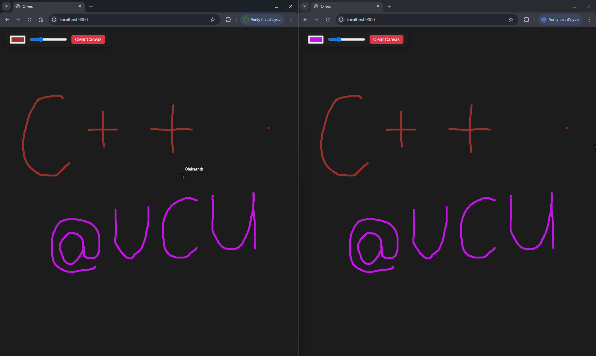

# **LWS: Lightweight Websocket Server**


LWS is a lightweight http server with websocket support. Main features are:
- Support for HTTP requests and responses
- Support for websockets
- Multithreading
- Lightweight
- Intuitive API
- Fast
- No dependencies

## Prerequisites
- **Linux**
- **g++** >= 14.2.0 or **clang** >= 18.1.3
- **cmake** >= 3.22

## Setup

Library can easily be added using cmake FetchContent:

```cmake
include(FetchContent)

FetchContent_Declare(
        lws
        GIT_REPOSITORY https://github.com/Kostyantin1408/web_server_cpp.git
        GIT_TAG main
)
FetchContent_MakeAvailable(lws)

target_link_libraries({YOUR_TARGET} lws)
```

## Usage

#### Initialize the server
```c++
WebServer server{{"127.0.0.1", 8080}};
```
#### Serve static files
```c++
server.get("/", [base_assets_path](const HttpRequest &req) {
  return HttpResponse::ServeStatic(base_assets_path, req, "/");
});
```
#### Process HTTP requests
```c++
server.post("/test", [](const HttpRequest &req) {
  return HttpResponse::Text("Received:\n" + req.body, 200);
});
```
#### Full list of predefined responses
```c++
HttpResponse::Text(const std::string& body, int status = 200);
HttpResponse::Json(const std::string& json_body, int status = 200);
HttpResponse::NotFound(const std::string& message = "404 Not Found");
HttpResponse::Redirect(const std::string& location, bool permanent = false);
HttpResponse::Html(const std::string& html, int status = 200);
HttpResponse::FromFile(const std::string& file_path, const std::string& content_type = "application/octet-stream");
HttpResponse::ServeStatic(const std::filesystem::path& base_path, const HttpRequest& req, const std::string& route_prefix = "/");
```

#### WebSocket communication
```c++
server.on_open([](WebSocket &ws) { std::cout << "Connection opened" << std::endl; })
  .on_message([](WebSocket &ws, std::string_view msg, WebSocket::OpCode opCode) {
     std::cout << "Message received: " << msg << std::endl;
     ws.send("Thanks for your message!", WebSocket::OpCode::TEXT);
  })
  .on_close([](WebSocket &ws) {
     std::cout << "Connection closed" << std::endl;
   });
server.activate_websockets(); // Enable websocket support
```

#### Start the server
```c++
server.run();
```

#### Stop if needed
```c++
server.request_stop();
server.wait_for_exit();
```

## Examples

### Olivec - Online painter using websockets

Olivec example demonstrates real-time WebSocket communication.
It is a collaborative drawing tool where multiple users can draw together on a shared canvas. The screenshot below shows the application in action:



### Simple Web Server - REST API demonstration
Simple Web Server example demonstrates how to use the Light Web Server to serve static assets, handle basic HTTP REST methods, and support WebSocket communication.

Check HTTP GET response:
```shell
curl -X GET http://127.0.0.1:8080/
```

Check working websockets at http://127.0.0.1:8080/test.html

## Benchmarking
Benchmarking of three different C++ web servers is done by measuring the time to complete 1000 sequential GET requests to the /hello endpoint over 200 iterations. LWS showed the best performance.
```text
| Server Name        | Avg (us) | Min (us) | StdDev (us) |   Avg RPS |
|--------------------|----------|----------|-------------|-----------|
| Custom WebServer   |       70 |       63 |           4 |     14180 |
| cpp-httplib        |       81 |       75 |           2 |     12326 |
| Crow               |       76 |       69 |           7 |     13111 |
```
